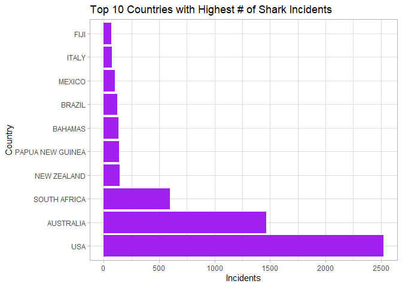
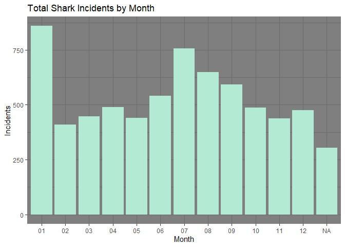
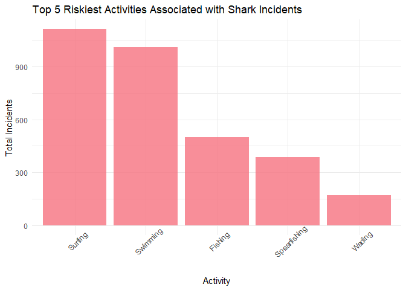
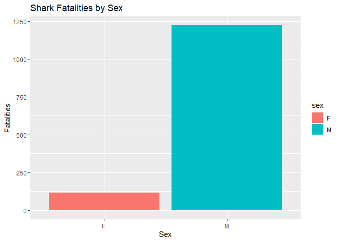
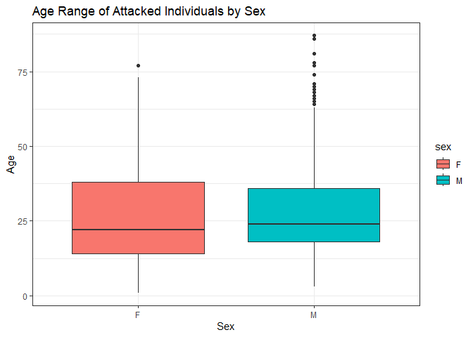
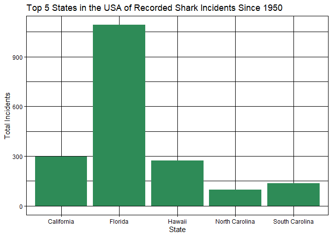
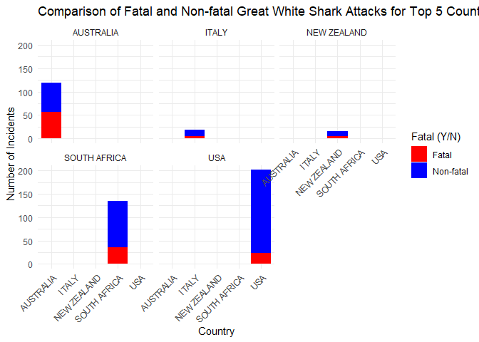

## Instructions
Answer the following questions and complete the exercises in RMarkdown. Please embed all of your code and push your final work to your repository. Your code must be organized, clean, and run free from errors. Remember, you must remove the `#` for any included code chunks to run. Be sure to add your name to the author header above. 

Your code must knit in order to be considered. If you are stuck and cannot answer a question, then comment out your code and knit the document.  

Don't forget to answer any questions that are asked in the prompt. Some questions will require a plot, but others do not- make sure to read each question carefully.  

For the questions that require a plot, make sure to have clearly labeled axes and a title. Keep your plots clean and professional-looking, but you are free to add color and other aesthetics.  

Be sure to follow the directions and push your code to your repository.

## Background
In the `data` folder, you will find data about global shark attacks. The data are updated continuously, and are taken from [opendatasoft](https://public.opendatasoft.com/explore/dataset/global-shark-attack/table/?flg=en-us&disjunctive.country&disjunctive.area&disjunctive.activity).  

## Load the libraries

```r
library("tidyverse")
library("janitor")
library("naniar")
```

## Load the data
Run the following code chunk to import the data.

```r
global_sharks <- read_csv("data/global-shark-attack.csv") %>% clean_names()
```

## Questions
1. (2 points) Start by doing some data exploration using your preferred function(s). What is the structure of the data? Where are the missing values and how are they represented?
The missing values are represented as NAs and they can be found in the following columns:type, location, activity, age, time, species, sex, area, date, pdf, href_formula, href, case_number_19, case_number_20, original_order. In the column fatal_y_n the missing values are represented as unknown, 

```r
glimpse(global_sharks)
```

```
## Rows: 6,890
## Columns: 21
## $ date                   <date> 2023-07-29, 2023-04-22, 2023-03-02, 2023-02-18…
## $ year                   <dbl> 2023, 2023, 2023, 2023, 2022, 2022, 2021, 2021,…
## $ type                   <chr> "Unprovoked", "Unprovoked", "Unprovoked", "Ques…
## $ country                <chr> "USA", "AUSTRALIA", "SEYCHELLES", "ARGENTINA", …
## $ area                   <chr> "Florida", "Western Australia", "Praslin Island…
## $ location               <chr> "Tampa Bay", "Lucy's Beach", NA, "Chubut Provin…
## $ activity               <chr> "Swimming", "Surfing", "Snorkeling", NA, "Snork…
## $ name                   <chr> "Natalie Branda", "Max Marsden", "Arthur \xc9",…
## $ sex                    <chr> "F", "M", "M", "M", "F", "M", "M", "M", "M", "M…
## $ age                    <chr> "26", "30", "6", "32", NA, "21.0", "15.0", "73.…
## $ injury                 <chr> "Superficial injuries to abomen and thighs", "B…
## $ fatal_y_n              <chr> "N", "N", "UNKNOWN", "UNKNOWN", "N", "N", "N", …
## $ time                   <chr> "20h00", "07h15", "Afternoon", NA, "12h30", "15…
## $ species                <chr> NA, "Bronze whaler shark, 1.5 m", "Lemon shark"…
## $ investigator_or_source <chr> "Fox12, 8/1/2023", "The West Australian, 4/22/2…
## $ pdf                    <chr> NA, NA, NA, NA, "2022.07.28-Cornwall.pdf", "202…
## $ href_formula           <chr> NA, NA, NA, NA, "http://sharkattackfile.net/spr…
## $ href                   <chr> NA, NA, NA, NA, "http://sharkattackfile.net/spr…
## $ case_number_19         <chr> NA, NA, NA, NA, "2022.07.28", "2022.03.09", "20…
## $ case_number_20         <chr> NA, NA, NA, NA, "2022.7.28", "2022.03.09", "202…
## $ original_order         <dbl> NA, NA, NA, NA, 6792, 6743, 6720, 6626, 6618, 6…
```

```r
naniar::miss_var_summary(global_sharks)
```

```
## # A tibble: 21 × 3
##    variable n_miss pct_miss
##    <chr>     <int>    <dbl>
##  1 time       3518    51.1 
##  2 species    3118    45.3 
##  3 age        2982    43.3 
##  4 activity    586     8.51
##  5 sex         572     8.30
##  6 location    565     8.20
##  7 area        481     6.98
##  8 date        305     4.43
##  9 name        220     3.19
## 10 year        132     1.92
## # ℹ 11 more rows
```


2. (3 points) Are there any "hotspots" for shark incidents? Make a plot that shows the total number of incidents for the top 10 countries? Which country has the highest number of incidents?
The United States has the highest number of incidents.


```r
names(global_sharks)
```

```
##  [1] "date"                   "year"                   "type"                  
##  [4] "country"                "area"                   "location"              
##  [7] "activity"               "name"                   "sex"                   
## [10] "age"                    "injury"                 "fatal_y_n"             
## [13] "time"                   "species"                "investigator_or_source"
## [16] "pdf"                    "href_formula"           "href"                  
## [19] "case_number_19"         "case_number_20"         "original_order"
```

```r
country_count <- global_sharks %>% 
  group_by(country) %>% 
  summarise(total_incidents = n()) %>% 
  arrange(desc(total_incidents))
```


```r
top_ten <- head(country_count, 10)
```


```r
ggplot(top_ten, aes(x = reorder(country, -total_incidents), y = total_incidents))+
  geom_bar(stat = "identity", fill = "purple")+
  coord_flip()+
  labs(title = "Top 10 Countries with Highest # of Shark Incidents",
       x = "Country",
       y = "Incidents")+
  theme_light()
```

<!-- -->

3. (3 points) Are there months of the year when incidents are more likely to occur? Make a plot that shows the total number of incidents by month. Which month has the highest number of incidents?
The month with the highest number of incidents is January. 

```r
sharks_dates_sep <- global_sharks %>% 
  separate(date, into = c("year", "month", "day"), sep = "-")
```


```r
month_counts <- sharks_dates_sep %>% 
  group_by(month) %>% 
  summarise(total_incidents = n()) %>% 
  arrange(desc(total_incidents))
```


```r
ggplot(month_counts, aes(x = month, y = total_incidents))+
  geom_bar(stat = "identity", fill = "#B2EAD3")+
  labs(title = "Total Shark Incidents by Month",
       x = "Month",
       y = "Incidents")+
  theme_dark()
```

<!-- -->


4. (3 points) Which activity is associated with the highest number of incidents? Make a plot that compares the top 5 riskiest activities. "NA" should not be classified as an activity.
Surfing is the activity with the highest number of incidents. 

```r
global_sharks_filt <- global_sharks %>% 
  filter(!is.na(activity) & activity != "NA")
```


```r
activity_count <- global_sharks_filt %>% 
  group_by(activity) %>% 
  summarise(total_incidents = n()) %>% 
  arrange(desc(total_incidents)) %>% 
  head(5)
```


```r
ggplot(activity_count, aes(x = reorder(activity, -total_incidents), y = total_incidents))+
  geom_bar(stat = "identity", fill = "#F67280", alpha = 0.8)+
  labs(title = "Top 5 Riskiest Activities Associated with Shark Incidents",
       x = "Activity",
       y= "Total Incidents")+
  theme_minimal()+
  theme(axis.text.x = element_text(angle = 45, hjust = 0.5))
```

<!-- -->

5. (3 points) The data include information on who was attacked. Make a plot that shows the total number of fatalities by sex- are males or females more likely to be killed by sharks?
Males are more likely to be killed. 

```r
fatalities <- global_sharks %>% 
  filter(fatal_y_n == "Y" & !is.na(sex) & !sex %in% c(".", "N"))
```


```r
fatalities_count <- fatalities %>% 
  group_by(sex) %>% 
  summarise(total_fatalities = n()) %>% 
  arrange(desc(total_fatalities))
```


```r
ggplot(fatalities_count, aes(x = sex, y = total_fatalities, fill = sex))+
  geom_bar(stat = "identity")+
  labs(title = "Shark Fatalities by Sex",
       x = "Sex",
       y= "Fatalities")+
  theme_gray()
```

<!-- -->

6. (3 points) Make a plot that shows the range of age for the individuals that are attacked. Make sure to restrict sex to M or F (some of the codes used are not clear). You will also need to find a way to manage the messy age column.

```r
filt_shark <- global_sharks %>% 
  filter(sex %in% c("M", "F") & !is.na(age) & str_detect(age, "^\\d+$"))
```


```r
filt_shark$age <- as.numeric(filt_shark$age)
```


```r
ggplot(filt_shark, aes(x = sex, y = age, fill = sex))+
  geom_boxplot()+
  labs(title = "Age Range of Attacked Individuals by Sex",
       x = "Sex",
       y = "Age")+
  theme_bw()
```

<!-- -->


7. (3 points) In the United States, what are the top 5 states where shark attacks have been recorded since 1950? Make a plot that compares the number of incidents for these 5 states.


```r
us_sharks <- global_sharks %>% 
  filter(country == "USA" & year >= 1950)
```


```r
state_count <- us_sharks %>% 
  group_by(area) %>% 
  summarise(total_incidents = n()) %>% 
  arrange(desc(total_incidents)) %>% 
  head(5)
```


```r
ggplot(state_count, aes(x = area, y = total_incidents))+
  geom_col(fill = "#2E8B57")+
  labs(title = "Top 5 States in the USA of Recorded Shark Incidents Since 1950", 
       x = "State",
       y = "Total Incidents")+
  theme_linedraw()
```

<!-- -->

8. (3 points) Make a new object that limits the data to only include attacks attributed to Great White Sharks. This is trickier than it sounds, you should end up with 494 observations. Look online and adapt code involving `str_detect`. Which country has the highest number of Great White Shark attacks?
The USA has the highest number.

```r
great_white_attacks <- global_sharks %>% 
  filter(str_detect(species, "(?i)white(?!.*\\btip\\b)") | str_detect(species, "(?i)great(?!.*\\btip\\b)")) %>% 
  filter(!str_detect(species, "(?i)oceanic\\s+whitetip") | !str_detect(species, "(?i)tiger|or|\\/|whitetip"))
#this is not accurate. I get 702 observations couldn't remove those including bull, oceaniic or tiger
```


```r
great_white_attacks %>% 
  group_by(country) %>% 
  summarise(total_incidents = n()) %>% 
  arrange(desc(total_incidents))
```

```
## # A tibble: 40 × 2
##    country      total_incidents
##    <chr>                  <int>
##  1 USA                      228
##  2 AUSTRALIA                180
##  3 SOUTH AFRICA             170
##  4 ITALY                     26
##  5 NEW ZEALAND               21
##  6 CROATIA                   11
##  7 CHILE                      6
##  8 GREECE                     5
##  9 BRAZIL                     4
## 10 JAPAN                      4
## # ℹ 30 more rows
```


9. (4 points) Use faceting to compare the number of fatal and non-fatal attacks for the top 5 countries with the highest number of Great White Shark attacks.
This output does not seem correct but I tried my best. Not sure how to fix it. 

```r
filtered_top_5_attacks <- great_white_attacks %>% 
  group_by(country, fatal_y_n) %>% 
  summarise(total_incidents = n()) %>% 
  arrange(desc(total_incidents))
```

```
## `summarise()` has grouped output by 'country'. You can override using the
## `.groups` argument.
```

```r
country_counts_wide <- filtered_top_5_attacks %>%
  pivot_wider(names_from = fatal_y_n, values_from = total_incidents) %>% 
  select(-UNKNOWN) %>% 
  head(5)
```


```r
ggplot(country_counts_wide, aes(x = country, y = N, fill = "Non-fatal")) +
  geom_bar(stat = "identity", position = "dodge") +
  geom_bar(aes(x = country, y = Y, fill = "Fatal"), stat = "identity", position = "dodge") +
  labs(title = "Comparison of Fatal and Non-fatal Great White Shark Attacks for Top 5 Countries",
       x = "Country",
       y = "Number of Incidents",
       fill = "Fatal (Y/N)") +
  scale_fill_manual(values = c("Non-fatal" = "blue", "Fatal" = "red")) +
  facet_wrap(~ country) +
  theme_minimal() +
  theme(axis.text.x = element_text(angle = 45, hjust = 1))
```

<!-- -->


10. (3 points) Using the `global_sharks` data, what is one question that you are interested in exploring? Write the question and answer it using a plot or table. 
Top 10 locations where shark incidents occur: 

```r
global_sharks %>%
  filter(!is.na(location), location != "Unknown") %>%
  group_by(location) %>%
  summarise(Count = n()) %>%
  arrange(desc(Count)) %>%
  head(10)
```

```
## # A tibble: 10 × 2
##    location                         Count
##    <chr>                            <int>
##  1 New Smyrna Beach, Volusia County   192
##  2 Daytona Beach, Volusia County       34
##  3 Ponce Inlet, Volusia County         26
##  4 Melbourne Beach, Brevard County     21
##  5 Myrtle Beach, Horry County          21
##  6 Cocoa Beach, Brevard  County        19
##  7 Durban                              18
##  8 Isle of Palms, Charleston County    16
##  9 Boa Viagem, Recife                  14
## 10 Piedade                             14
```

