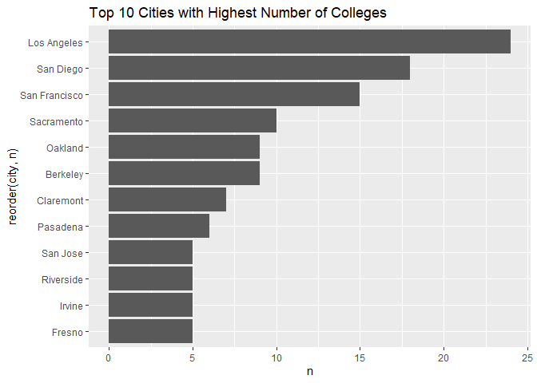
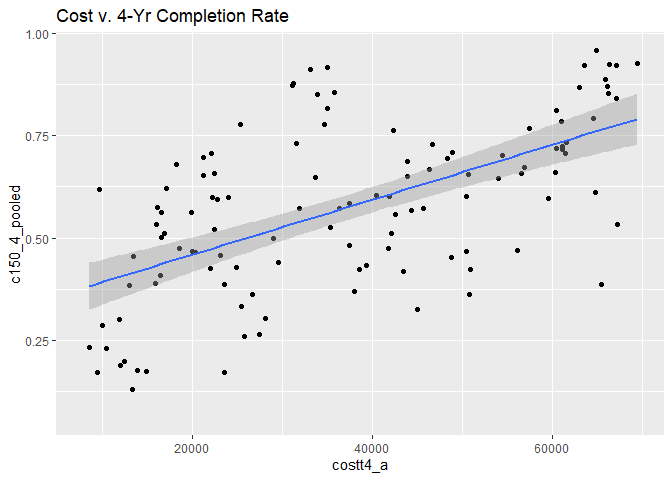

## Instructions
Answer the following questions and complete the exercises in RMarkdown. Please embed all of your code and push your final work to your repository. Your final lab report should be organized, clean, and run free from errors. Remember, you must remove the `#` for the included code chunks to run. Be sure to add your name to the author header above.  

Make sure to use the formatting conventions of RMarkdown to make your report neat and clean!  

## Load the libraries

```r
library(tidyverse)
library(janitor)
library(here)
library(naniar)
```

For this homework, we will take a departure from biological data and use data about California colleges. These data are a subset of the national college scorecard (https://collegescorecard.ed.gov/data/). Load the `ca_college_data.csv` as a new object called `colleges`.

```r
getwd()
```

```
## [1] "C:/Users/carmz/Desktop/BIS15W2024_cdoria/homework"
```


```r
colleges <- read_csv("data/ca_college_data.csv") %>% clean_names()
```

```
## Rows: 341 Columns: 10
## ── Column specification ────────────────────────────────────────────────────────
## Delimiter: ","
## chr (4): INSTNM, CITY, STABBR, ZIP
## dbl (6): ADM_RATE, SAT_AVG, PCIP26, COSTT4_A, C150_4_POOLED, PFTFTUG1_EF
## 
## ℹ Use `spec()` to retrieve the full column specification for this data.
## ℹ Specify the column types or set `show_col_types = FALSE` to quiet this message.
```

The variables are a bit hard to decipher, here is a key:  

INSTNM: Institution name  
CITY: California city  
STABBR: Location state  
ZIP: Zip code  
ADM_RATE: Admission rate  
SAT_AVG: SAT average score  
PCIP26: Percentage of degrees awarded in Biological And Biomedical Sciences  
COSTT4_A: Annual cost of attendance  
C150_4_POOLED: 4-year completion rate  
PFTFTUG1_EF: Percentage of undergraduate students who are first-time, full-time degree/certificate-seeking undergraduate students  

1. Use your preferred function(s) to have a look at the data and get an idea of its structure. Make sure you summarize NA's and determine whether or not the data are tidy. You may also consider dealing with any naming issues.


```r
head(colleges)
```

```
## # A tibble: 6 × 10
##   instnm       city  stabbr zip   adm_rate sat_avg pcip26 costt4_a c150_4_pooled
##   <chr>        <chr> <chr>  <chr>    <dbl>   <dbl>  <dbl>    <dbl>         <dbl>
## 1 Grossmont C… El C… CA     9202…       NA      NA 0.0016     7956            NA
## 2 College of … Visa… CA     9327…       NA      NA 0.0066     8109            NA
## 3 College of … San … CA     9440…       NA      NA 0.0038     8278            NA
## 4 Ventura Col… Vent… CA     9300…       NA      NA 0.0035     8407            NA
## 5 Oxnard Coll… Oxna… CA     9303…       NA      NA 0.0085     8516            NA
## 6 Moorpark Co… Moor… CA     9302…       NA      NA 0.0151     8577            NA
## # ℹ 1 more variable: pftftug1_ef <dbl>
```


```r
glimpse(colleges)
```

```
## Rows: 341
## Columns: 10
## $ instnm        <chr> "Grossmont College", "College of the Sequoias", "College…
## $ city          <chr> "El Cajon", "Visalia", "San Mateo", "Ventura", "Oxnard",…
## $ stabbr        <chr> "CA", "CA", "CA", "CA", "CA", "CA", "CA", "CA", "CA", "C…
## $ zip           <chr> "92020-1799", "93277-2214", "94402-3784", "93003-3872", …
## $ adm_rate      <dbl> NA, NA, NA, NA, NA, NA, NA, NA, NA, NA, NA, NA, NA, NA, …
## $ sat_avg       <dbl> NA, NA, NA, NA, NA, NA, NA, NA, NA, NA, NA, NA, NA, NA, …
## $ pcip26        <dbl> 0.0016, 0.0066, 0.0038, 0.0035, 0.0085, 0.0151, 0.0000, …
## $ costt4_a      <dbl> 7956, 8109, 8278, 8407, 8516, 8577, 8580, 9181, 9281, 93…
## $ c150_4_pooled <dbl> NA, NA, NA, NA, NA, NA, 0.2334, NA, NA, NA, NA, 0.1704, …
## $ pftftug1_ef   <dbl> 0.3546, 0.5413, 0.3567, 0.3824, 0.2753, 0.4286, 0.2307, …
```


```r
miss_var_summary(colleges)
```

```
## # A tibble: 10 × 3
##    variable      n_miss pct_miss
##    <chr>          <int>    <dbl>
##  1 sat_avg          276     80.9
##  2 adm_rate         240     70.4
##  3 c150_4_pooled    221     64.8
##  4 costt4_a         124     36.4
##  5 pftftug1_ef       53     15.5
##  6 pcip26            35     10.3
##  7 instnm             0      0  
##  8 city               0      0  
##  9 stabbr             0      0  
## 10 zip                0      0
```

2. Which cities in California have the highest number of colleges?
Los Angeles has the highest number of colleges

```r
names(colleges)
```

```
##  [1] "instnm"        "city"          "stabbr"        "zip"          
##  [5] "adm_rate"      "sat_avg"       "pcip26"        "costt4_a"     
##  [9] "c150_4_pooled" "pftftug1_ef"
```


```r
colleges %>%
  group_by(city) %>% 
  summarise(max_college = n_distinct(instnm)) %>% 
  arrange(desc(max_college))
```

```
## # A tibble: 161 × 2
##    city          max_college
##    <chr>               <int>
##  1 Los Angeles            24
##  2 San Diego              18
##  3 San Francisco          15
##  4 Sacramento             10
##  5 Berkeley                9
##  6 Oakland                 9
##  7 Claremont               7
##  8 Pasadena                6
##  9 Fresno                  5
## 10 Irvine                  5
## # ℹ 151 more rows
```


3. Based on your answer to #2, make a plot that shows the number of colleges in the top 10 cities.

```r
colleges %>% 
  count(city) %>% 
  top_n(10, n) %>% 
  ggplot(aes(x= reorder(city, n), y = n))+
  geom_col()+
  coord_flip()+
  labs(title= "Top 10 Cities with Highest Number of Colleges")
```

<!-- -->


4. The column `COSTT4_A` is the annual cost of each institution. Which city has the highest average cost? Where is it located?

Claremont has the highest average cost located in CA. 

```r
colleges %>% 
  group_by(city, stabbr) %>% 
  summarise(mean_cost = mean(costt4_a, na.rm = T)) %>% 
  arrange(desc(mean_cost))
```

```
## `summarise()` has grouped output by 'city'. You can override using the
## `.groups` argument.
```

```
## # A tibble: 161 × 3
## # Groups:   city [161]
##    city                stabbr mean_cost
##    <chr>               <chr>      <dbl>
##  1 Claremont           CA         66498
##  2 Malibu              CA         66152
##  3 Valencia            CA         64686
##  4 Orange              CA         64501
##  5 Redlands            CA         61542
##  6 Moraga              CA         61095
##  7 Atherton            CA         56035
##  8 Thousand Oaks       CA         54373
##  9 Rancho Palos Verdes CA         50758
## 10 La Verne            CA         50603
## # ℹ 151 more rows
```


5. Based on your answer to #4, make a plot that compares the cost of the individual colleges in the most expensive city. Bonus! Add UC Davis here to see how it compares :>).


```r
colleges %>% 
  filter(city %in% c("Claremont","Davis") & !is.na(costt4_a)) %>%
  ggplot(aes(x = reorder(instnm, costt4_a), y = costt4_a))+
  geom_col()+
  coord_flip()
```

<!-- -->

6. The column `ADM_RATE` is the admissions rate by college and `C150_4_POOLED` is the four-year completion rate. Use a scatterplot to show the relationship between these two variables. What do you think this means?
The completion rate increases when schools are more selective. 

```r
colleges %>%
  filter(!is.na(adm_rate), !is.na(c150_4_pooled)) %>% 
  ggplot(aes(x = adm_rate, y= c150_4_pooled))+
  geom_smooth(method = lm, se = T)+
  geom_point()+
  labs(title = "Admission Rate v. 4-Yr Completion Rate")
```

```
## `geom_smooth()` using formula = 'y ~ x'
```

<!-- -->


7. Is there a relationship between cost and four-year completion rate? (You don't need to do the stats, just produce a plot). What do you think this means?
Institutions with high 4 year completion rate are more expensive.

```r
colleges %>% 
  ggplot(aes(x = costt4_a, y = c150_4_pooled))+
  geom_point(na.rm = T)+
  geom_smooth(method = lm, se = T, na.rm = T)+
  labs(title= "Cost v. 4-Yr Completion Rate")
```

```
## `geom_smooth()` using formula = 'y ~ x'
```

<!-- -->


8. The column titled `INSTNM` is the institution name. We are only interested in the University of California colleges. Make a new data frame that is restricted to UC institutions. You can remove `Hastings College of Law` and `UC San Francisco` as we are only interested in undergraduate institutions.

```r
uc_only <- colleges %>% 
  filter_all(any_vars(str_detect(.,pattern = "University of California")))
```


Remove `Hastings College of Law` and `UC San Francisco` and store the final data frame as a new object `univ_calif_final`.

```r
univ_calif_final <- uc_only %>% 
  filter(instnm != "University of California-Hastings College of Law", instnm != "University of California-San Francisco")
```

Use `separate()` to separate institution name into two new columns "UNIV" and "CAMPUS".

```r
univ_calif_final <- univ_calif_final %>% 
  separate(col = instnm, into = c("UNIV", "CAMPUS"), sep = "-")
```


9. The column `ADM_RATE` is the admissions rate by campus. Which UC has the lowest and highest admissions rates? Produce a numerical summary and an appropriate plot.
The UC with the highest admission rate is Riverside and the lowest admission rate is Berkeley. UC merced not included?

```r
names(univ_calif_final)
```

```
##  [1] "UNIV"          "CAMPUS"        "city"          "stabbr"       
##  [5] "zip"           "adm_rate"      "sat_avg"       "pcip26"       
##  [9] "costt4_a"      "c150_4_pooled" "pftftug1_ef"
```


```r
univ_calif_final %>% 
  summarise(CAMPUS, adm_rate) %>% 
  ggplot(aes(x = CAMPUS, y = adm_rate))+
  geom_col()+
  coord_flip()+
  labs(title = "Admission Rate of UC Colleges")
```

```
## Warning: Returning more (or less) than 1 row per `summarise()` group was deprecated in
## dplyr 1.1.0.
## ℹ Please use `reframe()` instead.
## ℹ When switching from `summarise()` to `reframe()`, remember that `reframe()`
##   always returns an ungrouped data frame and adjust accordingly.
## Call `lifecycle::last_lifecycle_warnings()` to see where this warning was
## generated.
```

<!-- -->

10. If you wanted to get a degree in biological or biomedical sciences, which campus confers the majority of these degrees? Produce a numerical summary and an appropriate plot.
UC San Diego confers the majority of those degrees awarded.

```r
#PCIP26: Percentage of degrees awarded in Biological And Biomedical Sciences  
univ_calif_final %>% 
  summarise(CAMPUS, pcip26) %>% 
  ggplot(aes(x = reorder(CAMPUS,pcip26), y = pcip26))+
  geom_col()+
  coord_flip()+
  labs(title = "UC Degrees Awarded in Biological And Biomedical Sciences")
```

```
## Warning: Returning more (or less) than 1 row per `summarise()` group was deprecated in
## dplyr 1.1.0.
## ℹ Please use `reframe()` instead.
## ℹ When switching from `summarise()` to `reframe()`, remember that `reframe()`
##   always returns an ungrouped data frame and adjust accordingly.
## Call `lifecycle::last_lifecycle_warnings()` to see where this warning was
## generated.
```

<!-- -->


## Knit Your Output and Post to [GitHub](https://github.com/FRS417-DataScienceBiologists)
